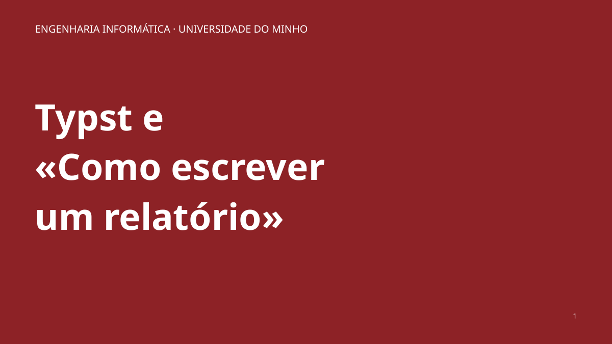
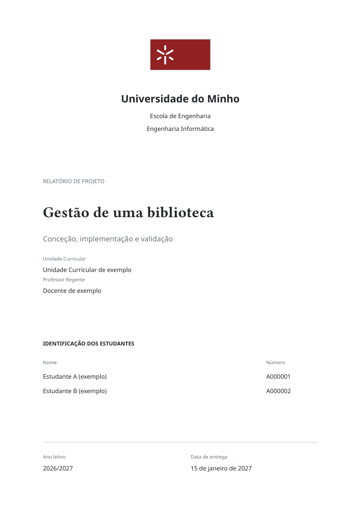
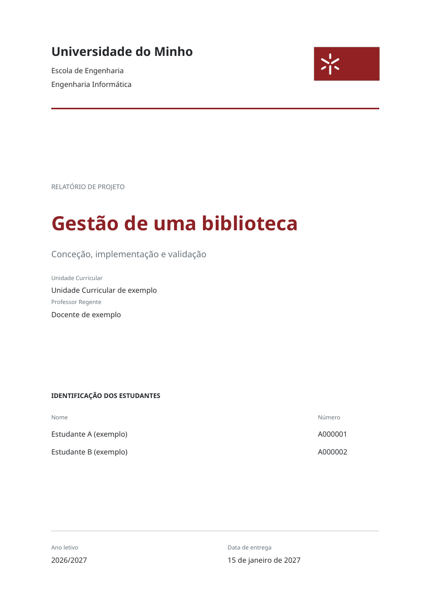
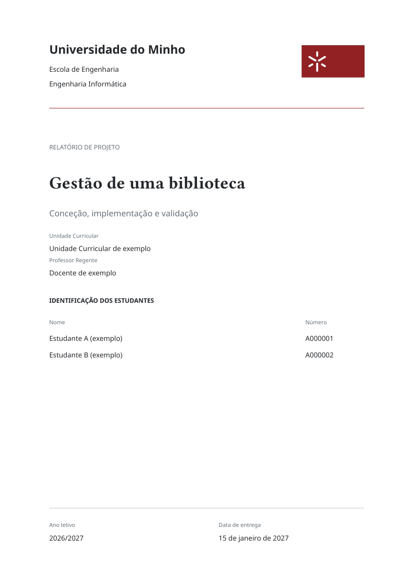

# Typst e «Como escrever um relatório»

Uma palestra para o segundo ano de Engenharia Informática da Universidade do Minho: **45 minutos**, aproximadamente **70% Typst e 30% escrita de relatórios**. Tudo o que é projetado é produzido em Typst.



## Começar aqui

- [Apresentação — 32 slides](output/pdf/apresentacao.pdf)
- [Guião completo do orador — percursos de 35, 45 e 55 minutos](output/pdf/guiao-orador.pdf)
- [Guia rápido — duas páginas](output/pdf/guia-rapido.pdf)
- [Descarregar o kit completo](https://github.com/salvatra/palestra-typst/raw/refs/heads/main/distribuicao/kit-completo.zip)

## Escolher um template

Todos os modelos estão em PT-PT, com Universidade do Minho, Escola de Engenharia, Engenharia Informática e ano letivo 2026/2027. Título, UC, Professor Regente e data ficam por preencher. O subtítulo é opcional; a lista de autores admite 2–6 estudantes, com nome e número.

| Clássico | Engenharia | Essencial |
|---|---|---|
|  |  |  |
| Capa simétrica e corpo serifado | Hierarquia contemporânea sem serifa | Composição leve e compacta |
| [Descarregar ZIP](https://github.com/salvatra/palestra-typst/raw/refs/heads/main/distribuicao/template-classico.zip) | [Descarregar ZIP](https://github.com/salvatra/palestra-typst/raw/refs/heads/main/distribuicao/template-engenharia.zip) | [Descarregar ZIP](https://github.com/salvatra/palestra-typst/raw/refs/heads/main/distribuicao/template-essencial.zip) |
| [PDF inicial](output/pdf/template-classico.pdf) · [Exemplo](output/pdf/template-classico-exemplo.pdf) | [PDF inicial](output/pdf/template-engenharia.pdf) · [Exemplo](output/pdf/template-engenharia-exemplo.pdf) | [PDF inicial](output/pdf/template-essencial.pdf) · [Exemplo](output/pdf/template-essencial-exemplo.pdf) |

1. Extrair o ZIP escolhido.
2. Preencher `metadados.typ` e escrever em `conteudo.typ`.
3. Compilar `main.typ`; consultar `exemplo.typ` para figuras, tabelas e bibliografia.
4. Abrir e rever o PDF final.

No [editor web](https://typst.app/), criar um projeto e carregar os ficheiros preservando as pastas; escolher `main.typ` como principal. O [playground](https://typst.app/play/) permite experimentar sem conta. Os ZIPs incluem as fontes necessárias e não dependem de ficheiros fora da sua pasta. As três bases de relatório compilam sem pacotes externos.

**São modelos da palestra, não modelos oficiais da Universidade. O enunciado da UC tem prioridade.** Os exemplos preenchidos incluem conteúdo e resultados fictícios, identificados no próprio documento.

## Preparar a palestra

- Personalizar `apresentacao/config.typ`: nome, data e ligação do QR. Nome e data vazios não aparecem.
- Projetar `output/pdf/apresentacao.pdf` em 16:9.
- Preparar [a demonstração](demonstracao/README.md) no navegador com `playground-01.typ`.
- Manter [a reserva da demo](output/pdf/demo-reserva.pdf) e [os cinco slides de apoio](output/pdf/slides-apoio.pdf) abertos.
- Ler o guião, que inclui falas, transições, ações, interação e tempos acumulados para os três percursos.
- Ensaiar com `python3 scripts/ensaio.py --duracao 45`. Enter avança; o registo local fica em `tmp/ensaio.json`.

A apresentação termina aos 40 minutos no percurso principal; seguem-se cinco minutos de perguntas com o QR projetado. As durações são metas para ensaio, não uma garantia sobre o ritmo de cada orador. A revelação de que os slides foram feitos em Typst fica reservada para o slide 31.

## Explorar os exemplos

- [Diagrama CeTZ editável](exemplos/cetz/arquitetura.typ) · [PDF](output/pdf/exemplo-cetz.pdf)
- [CV](output/pdf/exemplo-cv.pdf), [póster](output/pdf/exemplo-poster.pdf) e [ficha de exercícios](output/pdf/exemplo-ficha.pdf), com fontes em `exemplos/galeria`.
- [Pedidos úteis para LLMs](exemplos/pedidos-llm.md).
- [Fontes técnicas e notas de rigor por slide](guias/fontes.md).
- [Notas editáveis do orador](guias/notas.txt).

## Reconstruir tudo

Requisitos: **Typst 0.15.1**, Python 3 e `pdftoppm` (Poppler). Em Windows, pode usar WSL para reproduzir o comando de construção do kit; os templates funcionam diretamente no editor web ou no compilador Typst do sistema.

```sh
python3 scripts/build.py
```

O comando produz os 19 PDFs, pré-visualizações e quatro ZIPs. Na primeira compilação da apresentação e dos exemplos CeTZ, o Typst descarrega os pacotes e guarda-os em cache. Compilar uma vez antes de ficar sem Internet. Os PDFs prontos podem ser apresentados sem rede.

Para compilar apenas um relatório, a partir da pasta do modelo:

```sh
typst compile --font-path recursos/fonts main.typ relatorio.pdf
```

Versões fixadas: Touying 0.7.4, CeTZ 0.5.2 e Codetastic 0.2.2. Noto Sans acompanha o kit; Libertinus Serif, New Computer Modern Math e DejaVu Sans Mono são fornecidas pelo compilador. O ficheiro de estilo local é a fonte de verdade de cada template. `scripts/preparar.py` é uma ferramenta de manutenção que recria os modelos originais e pode sobrescrever personalizações; não é necessário executá-la para compilar.

## Licenças

Materiais originais sob [licença MIT](LICENSE), permitindo usar e adaptar os modelos. Os logótipos da Universidade do Minho mantêm os respetivos direitos e estão excluídos dessa licença. Noto Sans é distribuída com a [licença OFL](recursos/fonts/OFL.txt). Os pacotes externos conservam as suas próprias licenças.
